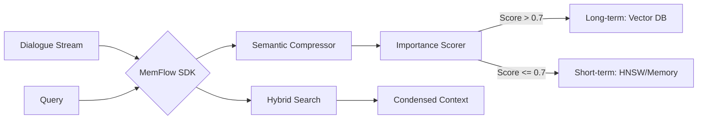

# 🌊 MemFlow

[English](./README.md) | [简体中文](./README_zh.md)

MemFlow is a high-performance Go SDK for LLM agent memory management. Evolved from the [SimpleMem](https://github.com/aiming-lab/SimpleMem) research, it provides a "production-ready" implementation of lifelong memory with automated tiering and semantic compression.

> [!TIP]
> **Why MemFlow?** Standard vector databases treat every dialogue equally, leading to token bloat and "memory noise". MemFlow uses LLM-based importance scoring to decide what stays in local cache and what gets archived to long-term vector storage.

---

## 🚀 Key Features

- **🧠 Deep Semantic Compression**: Automatically extracts "Memory Units" and resolves coreferences to save up to 80% of context tokens.
- **⚡ Automated Tiering**: 
    - **Hot Memory**: HNSW-indexed in-memory storage for immediate context.
    - **Cold Memory**: Seamlessly synced to Qdrant, Milvus, or LanceDB.
- **🔍 Hybrid Retrieval**: Combines Semantic (Vector), Lexical (BM25), and Metadata filtering for maximum recall.
- **Concurrency-First**: Sharded RWMutex design optimized for high-throughput Agentic workflows.

---

## 🛠 Architecture



---

## 📦 Installation

```bash
go get github.com/zenhouke/memflow-go
```

## 💻 Quick Start

```go
package main

import (
    "context"
    "time"
    "memflow"
)

func main() {
    ctx := context.Background()
    
    // Initialize with default config
    client := memflow.New(&MyEmbedder{})
    client.SetLLMClient(&MyLLMClient{})

    // Add dialogue - MemFlow handles compression & tiering behind the scenes
    client.AddDialogue(ctx, "session_001", "Alice", "I'm planning a trip to Tokyo next May.", time.Now())

    // Context-aware retrieval
    answer, _ := client.Ask(ctx, "session_001", "Where is Alice going?")
    println(answer)
}
```

---

## 📊 Comparison

| Feature | Raw Vector DB | MemFlow |
| :--- | :--- | :--- |
| **Token Usage** | High (Uncompressed) | Low (Extracted Units) |
| **Noise** | High (Includes 'ums' and 'errs') | Low (Pure Semantic Content) |
| **Scaling** | Search slows with size | O(1) Local Cache + Fast DB Sync |
| **Setup** | Complex Pipeline | Single Go Client |

---

## 📜 Acknowledgments

This project is a Go-first SDK implementation based on the [SimpleMem](https://github.com/aiming-lab/SimpleMem) paper.

```bibtex
@article{simplemem2026,
  title={SimpleMem: Efficient Lifelong Memory for LLM Agents},
  author={Aiming Lab},
  year={2026}
}
```
