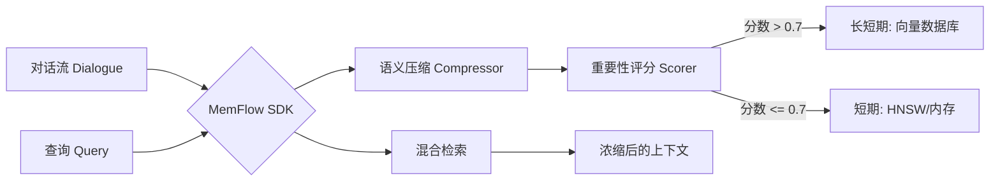

# 🌊 MemFlow

[English](./README.md) | [简体中文](./README_zh.md)

MemFlow 是一个为 LLM 智能体 (Agent) 量身定制的高性能 Go 记忆管理 SDK。它演化自 [SimpleMem](https://github.com/aiming-lab/SimpleMem) 研究项目，提供了一套面向生产环境的终身记忆实现，核心包括**自动化分层存储**和**语义压缩**。

> [!TIP]
> **为什么选择 MemFlow?** 标准的向量数据库对待每一句对话都是平等的，这会导致 Token 膨胀和“记忆噪声”。MemFlow 使用基于 LLM 的重要性评分方案，智能决定哪些内容留在本地缓存，哪些内容归档到长期向量数据库。

---

## 🚀 核心特性

- **🧠 深度语义压缩**: 自动提取“记忆单元 (Memory Units)”并解析指代关系，最高可节省 80% 的上下文 Token。
- **⚡ 自动化分层存储**: 
    - **热记忆 (Hot Memory)**: 基于 HNSW 索引的内存存储，用于即时上下文。
    - **冷记忆 (Cold Memory)**: 无缝同步至 Qdrant, Milvus 或 LanceDB 等向量库。
- **🔍 混合检索**: 结合语义 (Vector)、词法 (BM25) 和元数据过滤，确保存储的内容“既准又全”。
- **原生并发支持**: 采用分段读写锁 (Sharded RWMutex) 设计，专为高吞吐量的 Agent 流程优化。

---

## 🛠 系统架构



---

## 📦 安装

```bash
go get github.com/zenhouke/memflow-go
```

## 💻 快速开始

```go
package main

import (
    "context"
    "time"
    "memflow"
)

func main() {
    ctx := context.Background()
    
    // 使用默认配置初始化
    client := memflow.New(&MyEmbedder{})
    client.SetLLMClient(&MyLLMClient{})

    // 添加对话 - MemFlow 在后台自动处理压缩和分层
    client.AddDialogue(ctx, "session_001", "Alice", "我计划在明年五月去东京旅游。", time.Now())

    // 具备记忆感知能力的问答
    answer, _ := client.Ask(ctx, "session_001", "Alice 要去哪里？")
    println(answer)
}
```

---

## 📊 对比分析

| 特性 | 原始向量数据库 | MemFlow SDK |
| :--- | :--- | :--- |
| **Token 使用量** | 高 (未压缩的原始对话) | 低 (提取后的核心语义) |
| **噪声干扰** | 高 (包含语气词和冗余信息) | 低 (纯净的语义内容) |
| **扩展性** | 检索速度随数据量线性下降 | O(1) 本地缓存 + 快速数据库同步 |
| **集成成本** | 需构建复杂的 Pipeline | 单一 Go SDK，开箱即用 |

---

## 📜 致谢

本项目是基于 [SimpleMem](https://github.com/aiming-lab/SimpleMem) 论文的 Go 语言 SDK 化实现。

```bibtex
@article{simplemem2026,
  title={SimpleMem: Efficient Lifelong Memory for LLM Agents},
  author={Aiming Lab},
  year={2026}
}
```
